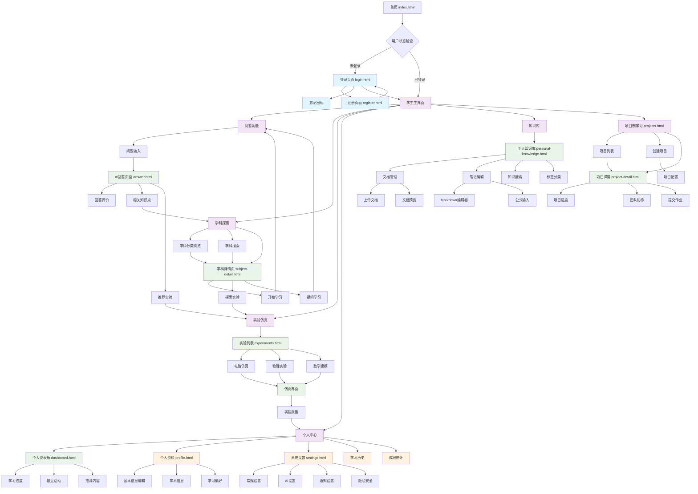

# Alethea平台 HMI 迁移图

## 项目概述
Alethea是一个专为高等教育理工科师生打造的智能知识问答平台，集成了多种AI模型、实验仿真、个人知识库等功能。

---

## 学生端 HMI 迁移图

---

## 教师端 HMI 迁移图

```mermaid
graph TD
    A[首页 index.html] --> B{用户状态检查}
    B -->|未登录| C[登录页面 login.html]
    B -->|已登录| D{角色判断}
    
    D -->|教师角色| E[教师主界面]
    D -->|管理员角色| F[管理员界面]
    
    C --> G[教师注册]
    C --> E
    G --> C
    
    %% 教师主界面
    E --> H[教师助手 teacher-dashboard.html]
    E --> I[课程管理]
    E --> J[学生管理]
    E --> K[作业批改]
    E --> L[数据分析]
    E --> M[个人中心]
    
    %% 教师助手功能
    H --> H1[课程概览]
    H --> H2[学生进度监控]
    H --> H3[AI助教功能]
    H --> H4[教学资源]
    H --> H5[快速操作]
    
    H1 --> H6[课程统计]
    H1 --> H7[学习热点]
    H2 --> H8[个人进度]
    H2 --> H9[班级排名]
    H3 --> H10[智能答疑]
    H3 --> H11[作业生成]
    H4 --> H12[课件管理]
    H4 --> H13[实验设计]
    
    %% 课程管理流程
    I --> I1[课程列表]
    I --> I2[创建课程]
    I --> I3[课程设置]
    I1 --> I4[课程详情]
    I2 --> I5[课程配置]
    I3 --> I6[权限设置]
    I4 --> I7[章节管理]
    I4 --> I8[资源上传]
    I4 --> I9[学生名单]
    
    %% 学生管理流程
    J --> J1[学生列表]
    J --> J2[学生分组]
    J --> J3[学习分析]
    J1 --> J4[学生详情]
    J2 --> J5[分组设置]
    J3 --> J6[个人报告]
    J3 --> J7[班级报告]
    J4 --> J8[学习轨迹]
    J4 --> J9[成绩记录]
    
    %% 作业批改流程
    K --> K1[待批改列表]
    K --> K2[批改历史]
    K --> K3[评分标准]
    K1 --> K4[作业详情]
    K2 --> K5[历史记录]
    K3 --> K6[标准设置]
    K4 --> K7[AI辅助批改]
    K4 --> K8[评语输入]
    K4 --> K9[成绩录入]
    
    %% 数据分析流程
    L --> L1[学习分析]
    L --> L2[教学效果]
    L --> L3[趋势预测]
    L1 --> L4[知识点掌握]
    L1 --> L5[学习时长]
    L2 --> L6[课程评价]
    L2 --> L7[改进建议]
    L3 --> L8[风险预警]
    L3 --> L9[个性化推荐]
    
    %% 个人中心（教师版）
    M --> M1[教师资料 profile.html]
    M --> M2[教学设置]
    M --> M3[系统设置 settings.html]
    M --> M4[教学历史]
    
    M1 --> M5[基本信息]
    M1 --> M6[教学经历]
    M1 --> M7[专业领域]
    M2 --> M8[教学偏好]
    M2 --> M9[AI助教配置]
    M3 --> M10[通知设置]
    M3 --> M11[隐私设置]
    
    %% 管理员功能
    F --> N[系统管理]
    F --> O[用户管理]
    F --> P[内容管理]
    F --> Q[数据统计]
    
    N --> N1[系统配置]
    N --> N2[功能开关]
    N --> N3[性能监控]
    O --> O1[用户列表]
    O --> O2[权限管理]
    O --> O3[账户审核]
    P --> P1[内容审核]
    P --> P2[资源管理]
    P --> P3[知识库维护]
    Q --> Q1[平台统计]
    Q --> Q2[使用分析]
    Q --> Q3[报告生成]
    
    %% 样式类
    classDef loginPage fill:#e1f5fe
    classDef teacherPage fill:#e8f5e8
    classDef adminPage fill:#ffebee
    classDef funcPage fill:#f3e5f5
    classDef personalPage fill:#fff3e0
    
    class C,G loginPage
    class E,H,I,J,K,L teacherPage
    class F,N,O,P,Q adminPage
    class H1,I4,J4,K4,L1,M1 funcPage
    class M2,M3,M4 personalPage
```

---

## 核心页面功能矩阵

| 页面/功能 | 学生端 | 教师端 | 管理员 | 主要功能 |
|-----------|--------|--------|--------|----------|
| **首页 (index.html)** | ✅ | ✅ | ✅ | 平台入口、学科探索、问答功能 |
| **登录页面 (login.html)** | ✅ | ✅ | ✅ | 用户认证、角色识别 |
| **个人仪表板 (dashboard.html)** | ✅ | ❌ | ✅ | 学习进度、个人统计 |
| **教师助手 (teacher-dashboard.html)** | ❌ | ✅ | ✅ | 教学管理、学生监控 |
| **问答页面 (answer.html)** | ✅ | ✅ | ✅ | AI问答、知识获取 |
| **学科详情 (subject-detail.html)** | ✅ | ✅ | ✅ | 学科介绍、学习路径 |
| **实验仿真 (experiments.html)** | ✅ | ✅ | ✅ | 虚拟实验、仿真操作 |
| **项目学习 (projects.html)** | ✅ | ✅ | ✅ | 项目制学习、团队协作 |
| **个人资料 (profile.html)** | ✅ | ✅ | ✅ | 个人信息、偏好设置 |
| **系统设置 (settings.html)** | ✅ | ✅ | ✅ | 系统配置、隐私设置 |
| **知识库 (personal-knowledge.html)** | ✅ | ✅ | ✅ | 个人文档、笔记管理 |

---

## 用户角色权限说明

### 🎓 学生端权限
- **基础学习功能**：问答、学科探索、实验仿真
- **个人管理**：学习进度、个人资料、知识库
- **协作学习**：项目参与、团队协作
- **数据查看**：个人统计、学习历史

### 👨‍🏫 教师端权限
- **教学管理**：课程创建、学生管理、作业批改
- **数据分析**：学习分析、教学效果评估
- **AI助教**：智能答疑、作业生成、个性化推荐
- **资源管理**：教学资源、实验设计

### 👨‍💼 管理员权限
- **系统管理**：平台配置、功能开关、性能监控
- **用户管理**：账户审核、权限分配、用户统计
- **内容管理**：内容审核、资源维护、知识库管理
- **数据统计**：平台分析、使用报告、趋势预测

---

## 技术架构说明

### 前端技术栈
- **HTML5 + CSS3**：页面结构和样式
- **JavaScript (ES6+)**：交互逻辑和状态管理
- **Tailwind CSS**：响应式设计框架
- **Font Awesome**：图标库
- **MathJax**：数学公式渲染
- **Chart.js**：数据可视化

### 后端集成
- **RESTful API**：与后端服务通信
- **WebSocket**：实时通信（可选）
- **本地存储**：用户状态和偏好设置
- **文件上传**：支持多媒体资源

### 响应式设计
- **桌面端**：完整功能体验
- **平板端**：适配中等屏幕
- **移动端**：核心功能优化
- **PWA支持**：离线访问能力

---

## 迁移路径优化建议

### 🚀 性能优化
1. **页面预加载**：关键页面资源预加载
2. **懒加载**：非关键内容按需加载
3. **缓存策略**：静态资源和API响应缓存
4. **代码分割**：按功能模块分割JavaScript

### 🔄 用户体验优化
1. **无缝切换**：页面间平滑过渡动画
2. **状态保持**：跨页面状态持久化
3. **错误处理**：友好的错误提示和恢复
4. **离线支持**：关键功能离线可用

### 📊 数据流优化
1. **状态管理**：统一的应用状态管理
2. **数据同步**：实时数据更新机制
3. **冲突解决**：多端数据冲突处理
4. **备份恢复**：用户数据备份和恢复

---

## 未来扩展规划

### 🔮 功能扩展
- **移动应用**：原生移动端应用
- **VR/AR支持**：沉浸式学习体验
- **语音交互**：语音问答和控制
- **多语言支持**：国际化界面

### 🤖 AI能力增强
- **个性化推荐**：基于学习行为的智能推荐
- **自适应学习**：动态调整学习路径
- **智能评估**：自动化学习效果评估
- **预测分析**：学习风险预警和干预

### 🌐 平台集成
- **LMS集成**：与现有学习管理系统对接
- **第三方工具**：集成专业软件和工具
- **开放API**：提供开发者接口
- **插件系统**：支持功能扩展插件

---

*本HMI迁移图展示了Alethea平台完整的用户界面流转关系，为产品设计、开发和测试提供了清晰的指导框架。*
