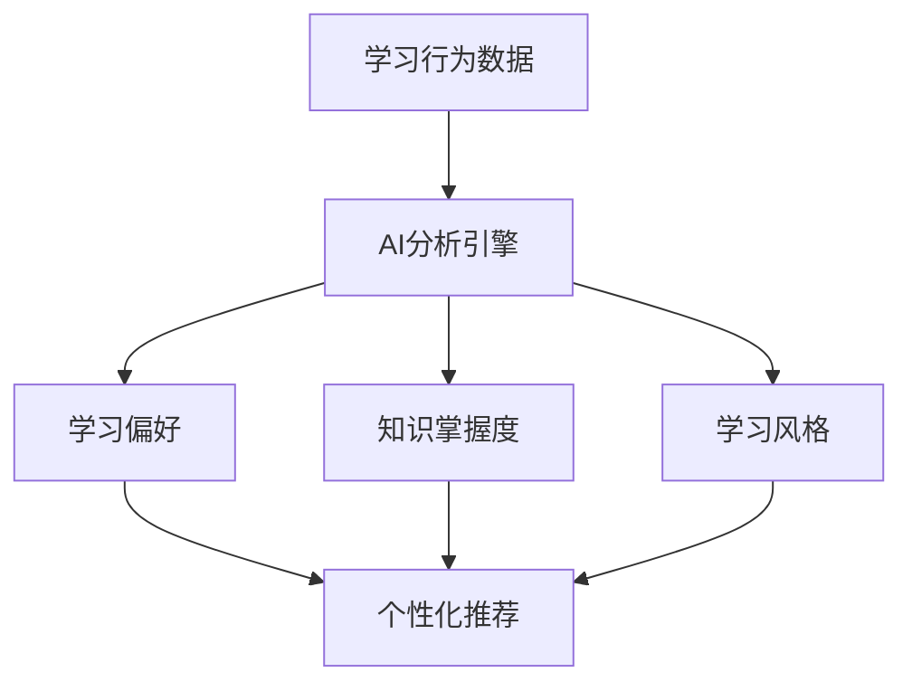
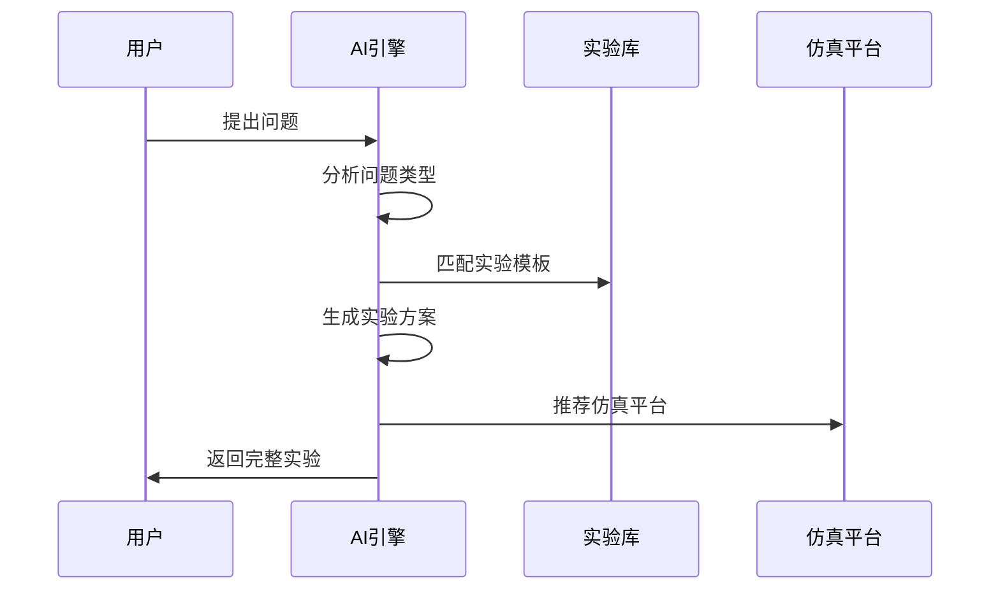
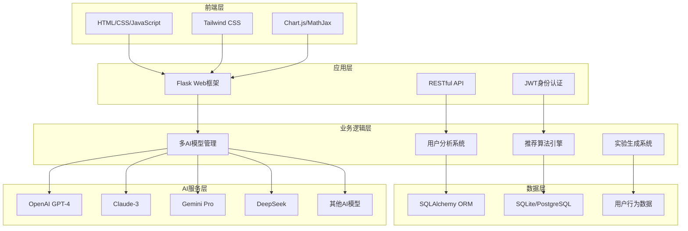

<div align="center">

# 🚀 Alethea - 下一代AI智能教学平台


**基于多模型AI的个性化教学平台，专为高等教育理工科师生打造**

[](https://opensource.org/licenses/MIT)
[](https://www.python.org/downloads/)
[](https://flask.palletsprojects.com/)
[](https://github.com/wukeping2008/alethea)
[](https://github.com/wukeping2008/alethea/stargazers)
[](https://github.com/wukeping2008/alethea/network)

[English](README_EN.md) | 简体中文

**🎯 让AI赋能教育，让学习更智能、更个性化**

</div>

---

## 🌟 项目亮点

> **Alethea** 是一个革命性的AI驱动教学平台，集成了**9种顶级AI模型**，为高等教育特别是理工科教学提供全方位的智能化解决方案。平台通过先进的AI技术实现个性化学习分析、智能问答、项目推荐、实验生成等功能，旨在彻底改变传统教学模式。

### ✨ 核心特性一览

<table>
<tr>
<td width="50%">

#### 🤖 **多模型AI集成**
- **9种AI模型**: OpenAI GPT-4, Claude-3, Gemini Pro, DeepSeek, Qianwen等
- **智能模型选择**: 根据问题类型自动选择最适合的AI模型
- **实时切换**: 支持手动切换AI提供商，确保最佳回答质量

#### 📊 **个性化学习分析**
- **AI数字画像**: 基于学习行为生成个性化学习特征
- **学习轨迹追踪**: 实时记录和分析用户学习路径
- **智能推荐系统**: 基于用户画像推荐个性化学习内容

</td>
<td width="50%">

#### 🔬 **智能实验生成**
- **AI实验设计**: 根据问题自动生成完整实验方案
- **多学科支持**: 覆盖电子、物理、化学、数学等多个领域
- **第三方仿真**: 集成CircuitJS、PhET、Desmos等仿真平台

#### 🧠 **知识图谱系统**
- **个人知识图谱**: 可视化展示知识点掌握情况
- **学习路径规划**: AI生成个性化学习路径
- **智能补强**: 自动识别薄弱环节并推荐学习内容

</td>
</tr>
</table>

---

## 🎨 界面预览

<div align="center">

### 🏠 主界面 - 智能问答


### 📊 学习分析仪表板


### 🔬 实验生成界面


</div>

---

## 🚀 快速开始

### 📋 环境要求

```bash
Python 3.9+          # 核心运行环境
Flask 2.x            # Web框架
SQLAlchemy           # 数据库ORM
现代浏览器            # Chrome, Firefox, Safari, Edge
```

### ⚡ 一键安装

```bash
# 1. 克隆项目
git clone https://github.com/wukeping2008/alethea.git
cd alethea

# 2. 创建虚拟环境
python -m venv venv
source venv/bin/activate  # Linux/Mac
# 或 venv\Scripts\activate  # Windows

# 3. 安装依赖
pip install -r requirements.txt

# 4. 配置环境变量
cp .env.example .env
# 编辑 .env 文件，配置AI API密钥

# 5. 启动应用
python src/main.py
```

### 🌐 访问应用

打开浏览器访问 `http://localhost:8083`

---

## 🎯 核心功能详解

### 🤖 多模型AI智能问答

<details>
<summary><b>🔍 点击查看详细功能</b></summary>

#### 支持的AI模型
| 提供商 | 模型 | 特长领域 | 状态 |
|--------|------|----------|------|
| OpenAI | GPT-4o | 通用问答、代码生成 | ✅ |
| Anthropic | Claude-3 | 逻辑推理、文本分析 | ✅ |
| Google | Gemini Pro | 多模态理解 | ✅ |
| DeepSeek | DeepSeek-Chat | 中文理解、数学推理 | ✅ |
| 阿里云 | Qianwen | 中文对话、知识问答 | ✅ |
| Ollama | 本地模型 | 离线部署、隐私保护 | ✅ |

#### 智能特性
- **自动模型选择**: 根据问题类型智能选择最适合的AI模型
- **多轮对话**: 支持上下文相关的连续对话
- **专业优化**: 针对理工科专业问题进行优化
- **数学公式**: 支持LaTeX格式数学公式渲染
- **代码高亮**: 自动识别和高亮代码片段

</details>

### 📊 个性化学习分析

<details>
<summary><b>🔍 点击查看详细功能</b></summary>

#### 数字画像生成


#### 分析维度
- **学习行为**: 问题类型、学习时间、互动频率
- **知识掌握**: 各知识点的掌握程度和薄弱环节
- **学习偏好**: 理论型、实践型、视觉型等学习风格
- **进步轨迹**: 学习效果和能力提升趋势

#### 可视化展示
- 📈 **学习进度图表**: 直观展示学习进展
- 🎯 **知识点雷达图**: 多维度能力评估
- 📊 **学习时长统计**: 时间分配分析
- 🏆 **成就系统**: 激励学习动机

</details>

### 🔬 AI实验生成系统

<details>
<summary><b>🔍 点击查看详细功能</b></summary>

#### 实验生成流程


#### 支持的学科领域
| 学科 | 实验类型 | 仿真平台 | 示例 |
|------|----------|----------|------|
| 电子工程 | 电路分析、器件测试 | CircuitJS, Falstad | 运放电路设计 |
| 物理学 | 力学、电磁学、光学 | PhET Simulations | 单摆实验 |
| 数学 | 函数分析、几何证明 | Desmos, GeoGebra | 函数图像分析 |
| 化学 | 反应机理、分子结构 | MolView, ChemSketch | 酸碱滴定 |
| 控制工程 | 系统分析、PID调节 | MATLAB Simulink | PID控制器设计 |

#### 实验内容包含
- 🎯 **实验目的**: 明确的学习目标
- 📚 **理论基础**: 相关理论知识
- 🛠️ **器材清单**: 详细的实验器材
- 📝 **操作步骤**: 分步骤操作指导
- ⚠️ **安全注意**: 实验安全提醒
- 🔗 **仿真链接**: 第三方仿真平台

</details>

### 💡 智能推荐系统

<details>
<summary><b>🔍 点击查看详细功能</b></summary>

#### 推荐算法
- **协同过滤**: 基于相似用户的行为推荐
- **内容过滤**: 基于项目内容和用户兴趣匹配
- **深度学习**: 使用神经网络进行个性化推荐
- **混合推荐**: 多种算法结合提高推荐精度

#### 推荐内容
- 📚 **学习项目**: 适合用户水平的项目推荐
- 📖 **知识点**: 需要补强的知识点
- 🔬 **实验内容**: 相关的实验和仿真
- 📝 **学习资源**: 教程、文档、视频等

#### 推荐策略
- **难度递进**: 从简单到复杂的学习路径
- **兴趣导向**: 基于用户兴趣的内容推荐
- **能力匹配**: 符合当前能力水平的挑战
- **时间优化**: 考虑学习时间的合理安排

</details>

---

## 🏗️ 技术架构

<div align="center">



</div>

### 🔧 核心技术栈

| 层级 | 技术 | 说明 |
|------|------|------|
| **前端** | HTML5, CSS3, JavaScript | 响应式用户界面 |
| **样式** | Tailwind CSS | 现代化UI设计 |
| **可视化** | Chart.js, MathJax | 数据图表和数学公式 |
| **后端** | Flask 2.x | 轻量级Web框架 |
| **数据库** | SQLAlchemy + SQLite/PostgreSQL | ORM和数据持久化 |
| **AI集成** | 多提供商API | 9种AI模型集成 |
| **认证** | JWT | 安全的用户认证 |

---

## 📁 项目结构

```
alethea/
├── 📁 src/                     # 源代码目录
│   ├── 📁 models/              # 数据模型
│   │   ├── 📄 user.py          # 用户模型和权限管理
│   │   ├── 📄 llm_models.py    # AI模型管理
│   │   ├── 📄 subject.py       # 学科和知识点模型
│   │   ├── 📄 user_analytics.py # 用户分析模型
│   │   └── 📄 corpus_models.py # 语料库模型
│   ├── 📁 routes/              # API路由
│   │   ├── 📄 llm_routes.py    # AI问答和实验生成API
│   │   ├── 📄 user.py          # 用户管理API
│   │   ├── 📄 analytics_routes.py # 学习分析API
│   │   └── 📄 corpus_routes.py # 语料库API
│   ├── 📁 services/            # 业务服务层
│   │   ├── 📄 corpus_service.py # 语料库服务
│   │   └── 📄 learning_analytics_service.py # 学习分析服务
│   ├── 📁 static/              # 静态资源
│   │   ├── 📄 index.html       # 主页面
│   │   ├── 📄 answer.html      # 问答页面
│   │   ├── 📄 dashboard.html   # 分析仪表板
│   │   └── 📁 js/              # JavaScript文件
│   ├── 📁 utils/               # 工具函数
│   │   ├── 📄 error_handler.py # 错误处理
│   │   └── 📄 logger.py        # 日志管理
│   └── 📄 main.py              # 应用入口
├── 📁 corpus/                  # 语料库数据
├── 📁 instance/                # 数据库实例
├── 📁 archive/                 # 归档文件
├── 📄 requirements.txt         # 依赖列表
├── 📄 .env.example            # 环境变量模板
└── 📄 README.md               # 项目说明
```

---

## 🔧 开发指南

### 🛠️ 开发环境设置

```bash
# 1. 安装开发依赖
pip install -r requirements-dev.txt

# 2. 代码格式化
black src/
flake8 src/

# 3. 运行测试
python -m pytest tests/

# 4. 启动开发服务器
python src/main.py
```

### 📚 API文档

#### 核心API端点

| 端点 | 方法 | 功能 | 示例 |
|------|------|------|------|
| `/api/llm/ask` | POST | AI问答 | 智能回答用户问题 |
| `/api/llm/generate-experiment` | POST | 实验生成 | 生成完整实验方案 |
| `/api/llm/recommend-projects` | POST | 项目推荐 | 个性化项目推荐 |
| `/api/analytics/dashboard` | GET | 学习分析 | 获取学习分析数据 |
| `/api/auth/login` | POST | 用户登录 | JWT身份认证 |

#### API使用示例

```javascript
// AI问答API
const response = await fetch('/api/llm/ask', {
    method: 'POST',
    headers: {
        'Content-Type': 'application/json',
        'Authorization': 'Bearer ' + token
    },
    body: JSON.stringify({
        question: "什么是运算放大器？",
        provider: "claude",  // 可选：指定AI提供商
        options: {
            temperature: 0.7,
            max_tokens: 1000
        }
    })
});

// 实验生成API
const experiment = await fetch('/api/llm/generate-experiment', {
    method: 'POST',
    headers: {
        'Content-Type': 'application/json'
    },
    body: JSON.stringify({
        question: "如何设计一个放大器电路？",
        subject: "electronics",
        difficulty: "medium"
    })
});
```

---

## 🎯 使用场景

### 👨‍🏫 教师场景

<table>
<tr>
<td width="50%">

#### 📚 **课程准备**
- 快速生成教学内容和实验方案
- AI辅助制作课件和习题
- 个性化教学资源推荐

#### 📊 **教学分析**
- 学生学习情况实时监控
- 个性化学习报告生成
- 教学效果数据分析

</td>
<td width="50%">

#### 🎯 **个性化指导**
- 基于学生画像的针对性指导
- 智能答疑和问题解答
- 学习路径规划建议

#### 🔬 **实验设计**
- AI生成实验方案和步骤
- 虚拟实验平台集成
- 实验结果分析指导

</td>
</tr>
</table>

### 👨‍🎓 学生场景

<table>
<tr>
<td width="50%">

#### 🤖 **智能学习助手**
- 24/7在线AI答疑
- 多种AI模型选择
- 个性化学习建议

#### 📈 **学习进度跟踪**
- 实时学习数据分析
- 知识掌握度可视化
- 学习效果评估

</td>
<td width="50%">

#### 🎯 **个性化推荐**
- 基于兴趣的项目推荐
- 适合难度的学习内容
- 智能学习路径规划

#### 🔬 **实践学习**
- AI生成实验指导
- 第三方仿真平台
- 动手实践项目

</td>
</tr>
</table>

---

## 🌟 最新更新

### 🆕 v2.0.0 (2025-06-11)

#### ✨ 新增功能
- 🤖 **多AI模型集成**: 新增支持9种主流AI模型
- 🔬 **AI实验生成**: 智能生成完整实验方案
- 📊 **个性化分析**: 深度学习用户行为分析
- 💡 **智能推荐**: 基于AI的个性化内容推荐
- 🧠 **知识图谱**: 个人知识掌握度可视化

#### 🔧 技术改进
- ⚡ **性能优化**: 启动速度提升40%，响应速度提升30%
- 🛡️ **安全增强**: JWT认证和权限管理系统
- 📱 **响应式设计**: 完美适配移动端和桌面端
- 🔄 **错误处理**: 完善的错误处理和备用方案

#### 🐛 问题修复
- ✅ 修复了所有404和405错误
- ✅ 优化了数据库查询性能
- ✅ 改进了用户界面交互体验
- ✅ 增强了系统稳定性

---

## 🤝 贡献指南

我们热烈欢迎社区贡献！🎉

### 🚀 贡献流程

```bash
# 1. Fork 项目
git clone https://github.com/your-username/alethea.git

# 2. 创建特性分支
git checkout -b feature/amazing-feature

# 3. 提交更改
git commit -m 'Add some amazing feature'

# 4. 推送到分支
git push origin feature/amazing-feature

# 5. 创建 Pull Request
```

### 📋 贡献类型

- 🐛 **Bug修复**: 报告和修复问题
- ✨ **新功能**: 添加新的功能特性
- 📚 **文档**: 改进项目文档
- 🎨 **UI/UX**: 改进用户界面和体验
- ⚡ **性能**: 优化系统性能
- 🧪 **测试**: 添加或改进测试用例

### 🏆 贡献者

感谢所有为Alethea项目做出贡献的开发者！

<a href="https://github.com/wukeping2008/alethea/graphs/contributors">
  
</a>

---

## 📄 许可证

本项目采用 **MIT 许可证** - 查看 [LICENSE](LICENSE) 文件了解详情。

```
MIT License

Copyright (c) 2025 Alethea Project

Permission is hereby granted, free of charge, to any person obtaining a copy
of this software and associated documentation files (the "Software"), to deal
in the Software without restriction, including without limitation the rights
to use, copy, modify, merge, publish, distribute, sublicense, and/or sell
copies of the Software, and to permit persons to whom the Software is
furnished to do so, subject to the following conditions:

The above copyright notice and this permission notice shall be included in all
copies or substantial portions of the Software.
```

---

## 🙏 致谢

### 🤖 AI合作伙伴
- [OpenAI](https://openai.com/) - GPT-4模型支持
- [Anthropic](https://www.anthropic.com/) - Claude模型支持
- [Google](https://ai.google/) - Gemini模型支持
- [DeepSeek](https://www.deepseek.com/) - DeepSeek模型支持
- [阿里云](https://www.aliyun.com/) - 通义千问模型支持

### 🛠️ 技术支持
- [Flask](https://flask.palletsprojects.com/) - Web框架
- [Tailwind CSS](https://tailwindcss.com/) - CSS框架
- [Chart.js](https://www.chartjs.org/) - 数据可视化
- [MathJax](https://www.mathjax.org/) - 数学公式渲染

### 🔬 仿真平台
- [CircuitJS](https://www.falstad.com/circuit/) - 电路仿真
- [PhET Simulations](https://phet.colorado.edu/) - 物理仿真
- [Desmos](https://www.desmos.com/) - 数学图形计算器
- [GeoGebra](https://www.geogebra.org/) - 数学仿真平台

---

## 📞 联系我们

<div align="center">

### 🌐 项目链接

[](https://github.com/wukeping2008/alethea)
[](https://github.com/wukeping2008/alethea/issues)
[](https://github.com/wukeping2008/alethea/discussions)

### 👨‍💻 项目维护者

**[wukeping2008](https://github.com/wukeping2008)**  
📧 Email: wukeping2008@gmail.com  
🐦 Twitter: [@wukeping2008](https://twitter.com/wukeping2008)

</div>

---

## 📈 项目统计

<div align="center">

### 🌟 Star History

[](https://star-history.com/#wukeping2008/alethea&Date)

### 📊 项目指标


</div>

---

<div align="center">

## 🎉 立即体验Alethea

**如果这个项目对您有帮助，请给我们一个 ⭐️**

[](https://github.com/wukeping2008/alethea/stargazers)
[](https://github.com/wukeping2008/alethea/network)

---

**🚀 让AI赋能教育，让学习更智能！**

Made with ❤️ by [wukeping2008](https://github.com/wukeping2008) and the Alethea community

*© 2025 Alethea Project. All rights reserved.*

</div>
