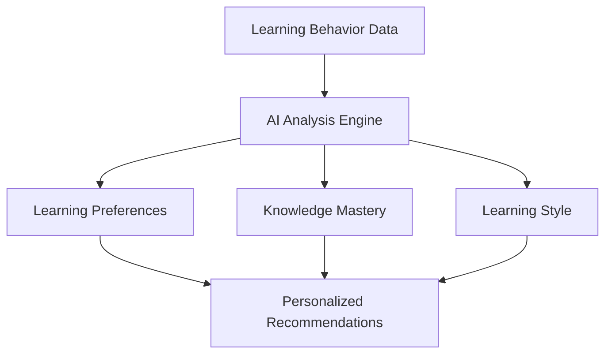
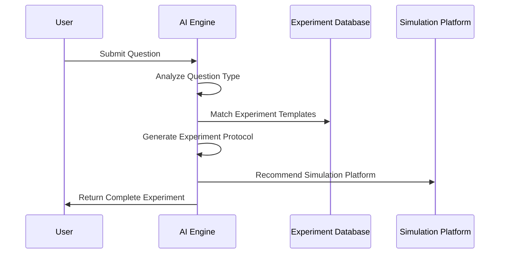
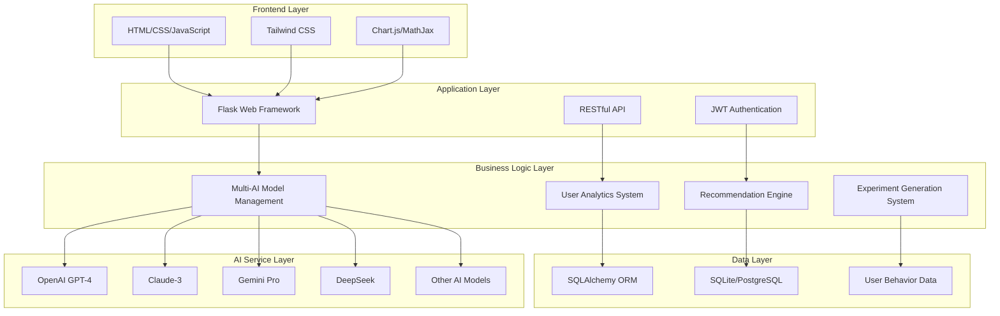

<div align="center">

# 🚀 Alethea - Next-Generation AI-Powered Educational Platform


**Multi-Model AI-Driven Personalized Learning Platform for Higher Education in STEM Fields**

[](https://opensource.org/licenses/MIT)
[](https://www.python.org/downloads/)
[](https://flask.palletsprojects.com/)
[](https://github.com/wukeping2008/alethea)
[](https://github.com/wukeping2008/alethea/stargazers)
[](https://github.com/wukeping2008/alethea/network)

English | [简体中文](README.md)

**🎯 Empowering Education with AI - Making Learning Smarter and More Personalized**

</div>

---

## 🌟 Project Highlights

> **Alethea** is a revolutionary AI-driven educational platform that integrates **9 cutting-edge AI models** to provide comprehensive intelligent solutions for higher education, particularly in STEM fields. The platform leverages advanced AI technology to deliver personalized learning analytics, intelligent Q&A, project recommendations, experiment generation, and more, aiming to transform traditional teaching methods.

### ✨ Core Features Overview

<table>
<tr>
<td width="50%">

#### 🤖 **Multi-Model AI Integration**
- **9 AI Models**: OpenAI GPT-4, Claude-3, Gemini Pro, DeepSeek, Qianwen, etc.
- **Smart Model Selection**: Automatically chooses the most suitable AI model based on question type
- **Real-time Switching**: Support manual switching between AI providers for optimal response quality

#### 📊 **Personalized Learning Analytics**
- **AI Digital Profiles**: Generate personalized learning characteristics based on behavior
- **Learning Path Tracking**: Real-time recording and analysis of user learning trajectories
- **Intelligent Recommendation**: AI-based personalized content recommendations

</td>
<td width="50%">

#### 🔬 **Intelligent Experiment Generation**
- **AI Experiment Design**: Automatically generate complete experimental protocols based on questions
- **Multi-Disciplinary Support**: Covers electronics, physics, chemistry, mathematics, and more
- **Third-Party Simulations**: Integration with CircuitJS, PhET, Desmos, and other platforms

#### 🧠 **Knowledge Graph System**
- **Personal Knowledge Graphs**: Visualize knowledge point mastery
- **Learning Path Planning**: AI-generated personalized learning paths
- **Intelligent Reinforcement**: Automatically identify weak areas and recommend content

</td>
</tr>
</table>

---

## 🎨 Interface Preview

<div align="center">

### 🏠 Main Interface - Intelligent Q&A


### 📊 Learning Analytics Dashboard


### 🔬 Experiment Generation Interface


</div>

---

## 🚀 Quick Start

### 📋 System Requirements

```bash
Python 3.9+          # Core runtime environment
Flask 2.x            # Web framework
SQLAlchemy           # Database ORM
Modern Browser       # Chrome, Firefox, Safari, Edge
```

### ⚡ One-Click Installation

```bash
# 1. Clone the repository
git clone https://github.com/wukeping2008/alethea.git
cd alethea

# 2. Create virtual environment
python -m venv venv
source venv/bin/activate  # Linux/Mac
# or venv\Scripts\activate  # Windows

# 3. Install dependencies
pip install -r requirements.txt

# 4. Configure environment variables
cp .env.example .env
# Edit .env file to configure AI API keys

# 5. Start the application
python src/main.py
```

### 🌐 Access Application

Open your browser and visit `http://localhost:8083`

---

## 🎯 Core Features Detailed

### 🤖 Multi-Model AI Intelligent Q&A

<details>
<summary><b>🔍 Click to view detailed features</b></summary>

#### Supported AI Models
| Provider | Model | Specialization | Status |
|----------|-------|----------------|--------|
| OpenAI | GPT-4o | General Q&A, Code Generation | ✅ |
| Anthropic | Claude-3 | Logical Reasoning, Text Analysis | ✅ |
| Google | Gemini Pro | Multimodal Understanding | ✅ |
| DeepSeek | DeepSeek-Chat | Chinese Understanding, Math Reasoning | ✅ |
| Alibaba Cloud | Qianwen | Chinese Dialogue, Knowledge Q&A | ✅ |
| Ollama | Local Models | Offline Deployment, Privacy Protection | ✅ |

#### Intelligent Features
- **Automatic Model Selection**: Intelligently choose the most suitable AI model based on question type
- **Multi-turn Dialogue**: Support context-aware continuous conversations
- **Professional Optimization**: Optimized for STEM field questions
- **Mathematical Formulas**: Support LaTeX format mathematical formula rendering
- **Code Highlighting**: Automatic code snippet recognition and highlighting

</details>

### 📊 Personalized Learning Analytics

<details>
<summary><b>🔍 Click to view detailed features</b></summary>

#### Digital Profile Generation


#### Analysis Dimensions
- **Learning Behavior**: Question types, learning time, interaction frequency
- **Knowledge Mastery**: Mastery level and weak areas for each knowledge point
- **Learning Preferences**: Theoretical, practical, visual learning styles
- **Progress Tracking**: Learning effectiveness and capability improvement trends

#### Visualization Display
- 📈 **Learning Progress Charts**: Intuitive display of learning progress
- 🎯 **Knowledge Point Radar Charts**: Multi-dimensional capability assessment
- 📊 **Learning Time Statistics**: Time allocation analysis
- 🏆 **Achievement System**: Motivate learning engagement

</details>

### 🔬 AI Experiment Generation System

<details>
<summary><b>🔍 Click to view detailed features</b></summary>

#### Experiment Generation Process


#### Supported Disciplines
| Discipline | Experiment Types | Simulation Platforms | Examples |
|------------|------------------|---------------------|----------|
| Electronics | Circuit Analysis, Device Testing | CircuitJS, Falstad | Op-Amp Circuit Design |
| Physics | Mechanics, Electromagnetics, Optics | PhET Simulations | Pendulum Experiment |
| Mathematics | Function Analysis, Geometric Proof | Desmos, GeoGebra | Function Graph Analysis |
| Chemistry | Reaction Mechanisms, Molecular Structure | MolView, ChemSketch | Acid-Base Titration |
| Control Engineering | System Analysis, PID Control | MATLAB Simulink | PID Controller Design |

#### Experiment Content Includes
- 🎯 **Experiment Objectives**: Clear learning goals
- 📚 **Theoretical Foundation**: Related theoretical knowledge
- 🛠️ **Equipment List**: Detailed experimental equipment
- 📝 **Procedure Steps**: Step-by-step operation guidance
- ⚠️ **Safety Notes**: Experimental safety reminders
- 🔗 **Simulation Links**: Third-party simulation platforms

</details>

### 💡 Intelligent Recommendation System

<details>
<summary><b>🔍 Click to view detailed features</b></summary>

#### Recommendation Algorithms
- **Collaborative Filtering**: Recommendations based on similar user behaviors
- **Content Filtering**: Matching based on project content and user interests
- **Deep Learning**: Neural networks for personalized recommendations
- **Hybrid Recommendations**: Multiple algorithms combined for improved accuracy

#### Recommendation Content
- 📚 **Learning Projects**: Project recommendations suitable for user level
- 📖 **Knowledge Points**: Knowledge points that need reinforcement
- 🔬 **Experimental Content**: Related experiments and simulations
- 📝 **Learning Resources**: Tutorials, documentation, videos, etc.

#### Recommendation Strategies
- **Progressive Difficulty**: Learning paths from simple to complex
- **Interest-Oriented**: Content recommendations based on user interests
- **Capability Matching**: Challenges that match current capability level
- **Time Optimization**: Reasonable learning time arrangements

</details>

---

## 🏗️ Technical Architecture

<div align="center">



</div>

### 🔧 Core Technology Stack

| Layer | Technology | Description |
|-------|------------|-------------|
| **Frontend** | HTML5, CSS3, JavaScript | Responsive user interface |
| **Styling** | Tailwind CSS | Modern UI design |
| **Visualization** | Chart.js, MathJax | Data charts and mathematical formulas |
| **Backend** | Flask 2.x | Lightweight web framework |
| **Database** | SQLAlchemy + SQLite/PostgreSQL | ORM and data persistence |
| **AI Integration** | Multi-provider APIs | 9 AI model integrations |
| **Authentication** | JWT | Secure user authentication |

---

## 📁 Project Structure

```
alethea/
├── 📁 src/                     # Source code directory
│   ├── 📁 models/              # Data models
│   │   ├── 📄 user.py          # User model and permission management
│   │   ├── 📄 llm_models.py    # AI model management
│   │   ├── 📄 subject.py       # Subject and knowledge point models
│   │   ├── 📄 user_analytics.py # User analytics models
│   │   └── 📄 corpus_models.py # Corpus models
│   ├── 📁 routes/              # API routes
│   │   ├── 📄 llm_routes.py    # AI Q&A and experiment generation API
│   │   ├── 📄 user.py          # User management API
│   │   ├── 📄 analytics_routes.py # Learning analytics API
│   │   └── 📄 corpus_routes.py # Corpus API
│   ├── 📁 services/            # Business service layer
│   │   ├── 📄 corpus_service.py # Corpus service
│   │   └── 📄 learning_analytics_service.py # Learning analytics service
│   ├── 📁 static/              # Static resources
│   │   ├── 📄 index.html       # Main page
│   │   ├── 📄 answer.html      # Q&A page
│   │   ├── 📄 dashboard.html   # Analytics dashboard
│   │   └── 📁 js/              # JavaScript files
│   ├── 📁 utils/               # Utility functions
│   │   ├── 📄 error_handler.py # Error handling
│   │   └── 📄 logger.py        # Log management
│   └── 📄 main.py              # Application entry point
├── 📁 corpus/                  # Corpus data
├── 📁 instance/                # Database instance
├── 📁 archive/                 # Archive files
├── 📄 requirements.txt         # Dependencies list
├── 📄 .env.example            # Environment variables template
└── 📄 README.md               # Project description
```

---

## 🔧 Development Guide

### 🛠️ Development Environment Setup

```bash
# 1. Install development dependencies
pip install -r requirements-dev.txt

# 2. Code formatting
black src/
flake8 src/

# 3. Run tests
python -m pytest tests/

# 4. Start development server
python src/main.py
```

### 📚 API Documentation

#### Core API Endpoints

| Endpoint | Method | Function | Example |
|----------|--------|----------|---------|
| `/api/llm/ask` | POST | AI Q&A | Intelligent answers to user questions |
| `/api/llm/generate-experiment` | POST | Experiment generation | Generate complete experimental protocols |
| `/api/llm/recommend-projects` | POST | Project recommendations | Personalized project recommendations |
| `/api/analytics/dashboard` | GET | Learning analytics | Get learning analytics data |
| `/api/auth/login` | POST | User login | JWT authentication |

#### API Usage Examples

```javascript
// AI Q&A API
const response = await fetch('/api/llm/ask', {
    method: 'POST',
    headers: {
        'Content-Type': 'application/json',
        'Authorization': 'Bearer ' + token
    },
    body: JSON.stringify({
        question: "What is an operational amplifier?",
        provider: "claude",  // Optional: specify AI provider
        options: {
            temperature: 0.7,
            max_tokens: 1000
        }
    })
});

// Experiment generation API
const experiment = await fetch('/api/llm/generate-experiment', {
    method: 'POST',
    headers: {
        'Content-Type': 'application/json'
    },
    body: JSON.stringify({
        question: "How to design an amplifier circuit?",
        subject: "electronics",
        difficulty: "medium"
    })
});
```

---

## 🎯 Use Cases

### 👨‍🏫 Teacher Scenarios

<table>
<tr>
<td width="50%">

#### 📚 **Course Preparation**
- Quickly generate teaching content and experimental protocols
- AI-assisted creation of courseware and exercises
- Personalized teaching resource recommendations

#### 📊 **Teaching Analytics**
- Real-time monitoring of student learning progress
- Personalized learning report generation
- Teaching effectiveness data analysis

</td>
<td width="50%">

#### 🎯 **Personalized Guidance**
- Targeted guidance based on student profiles
- Intelligent Q&A and problem solving
- Learning path planning suggestions

#### 🔬 **Experiment Design**
- AI-generated experimental protocols and procedures
- Virtual experiment platform integration
- Experimental result analysis guidance

</td>
</tr>
</table>

### 👨‍🎓 Student Scenarios

<table>
<tr>
<td width="50%">

#### 🤖 **Intelligent Learning Assistant**
- 24/7 online AI tutoring
- Multiple AI model options
- Personalized learning suggestions

#### 📈 **Learning Progress Tracking**
- Real-time learning data analysis
- Knowledge mastery visualization
- Learning effectiveness assessment

</td>
<td width="50%">

#### 🎯 **Personalized Recommendations**
- Interest-based project recommendations
- Appropriate difficulty learning content
- Intelligent learning path planning

#### 🔬 **Practical Learning**
- AI-generated experiment guidance
- Third-party simulation platforms
- Hands-on practice projects

</td>
</tr>
</table>

---

## 🌟 Latest Updates

### 🆕 v2.0.0 (2025-06-11)

#### ✨ New Features
- 🤖 **Multi-AI Model Integration**: Added support for 9 mainstream AI models
- 🔬 **AI Experiment Generation**: Intelligent generation of complete experimental protocols
- 📊 **Personalized Analytics**: Deep learning user behavior analysis
- 💡 **Intelligent Recommendations**: AI-based personalized content recommendations
- 🧠 **Knowledge Graphs**: Personal knowledge mastery visualization

#### 🔧 Technical Improvements
- ⚡ **Performance Optimization**: 40% faster startup, 30% faster response times
- 🛡️ **Security Enhancement**: JWT authentication and permission management system
- 📱 **Responsive Design**: Perfect adaptation for mobile and desktop
- 🔄 **Error Handling**: Comprehensive error handling and fallback mechanisms

#### 🐛 Bug Fixes
- ✅ Fixed all 404 and 405 errors
- ✅ Optimized database query performance
- ✅ Improved user interface interaction experience
- ✅ Enhanced system stability

---

## 🤝 Contributing

We warmly welcome community contributions! 🎉

### 🚀 Contribution Process

```bash
# 1. Fork the project
git clone https://github.com/your-username/alethea.git

# 2. Create feature branch
git checkout -b feature/amazing-feature

# 3. Commit changes
git commit -m 'Add some amazing feature'

# 4. Push to branch
git push origin feature/amazing-feature

# 5. Create Pull Request
```

### 📋 Contribution Types

- 🐛 **Bug Fixes**: Report and fix issues
- ✨ **New Features**: Add new functionality
- 📚 **Documentation**: Improve project documentation
- 🎨 **UI/UX**: Improve user interface and experience
- ⚡ **Performance**: Optimize system performance
- 🧪 **Testing**: Add or improve test cases

### 🏆 Contributors

Thanks to all developers who have contributed to the Alethea project!

<a href="https://github.com/wukeping2008/alethea/graphs/contributors">
  
</a>

---

## 📄 License

This project is licensed under the **MIT License** - see the [LICENSE](LICENSE) file for details.

```
MIT License

Copyright (c) 2025 Alethea Project

Permission is hereby granted, free of charge, to any person obtaining a copy
of this software and associated documentation files (the "Software"), to deal
in the Software without restriction, including without limitation the rights
to use, copy, modify, merge, publish, distribute, sublicense, and/or sell
copies of the Software, and to permit persons to whom the Software is
furnished to do so, subject to the following conditions:

The above copyright notice and this permission notice shall be included in all
copies or substantial portions of the Software.
```

---

## 🙏 Acknowledgments

### 🤖 AI Partners
- [OpenAI](https://openai.com/) - GPT-4 model support
- [Anthropic](https://www.anthropic.com/) - Claude model support
- [Google](https://ai.google/) - Gemini model support
- [DeepSeek](https://www.deepseek.com/) - DeepSeek model support
- [Alibaba Cloud](https://www.aliyun.com/) - Qianwen model support

### 🛠️ Technical Support
- [Flask](https://flask.palletsprojects.com/) - Web framework
- [Tailwind CSS](https://tailwindcss.com/) - CSS framework
- [Chart.js](https://www.chartjs.org/) - Data visualization
- [MathJax](https://www.mathjax.org/) - Mathematical formula rendering

### 🔬 Simulation Platforms
- [CircuitJS](https://www.falstad.com/circuit/) - Circuit simulation
- [PhET Simulations](https://phet.colorado.edu/) - Physics simulation
- [Desmos](https://www.desmos.com/) - Mathematical graphing calculator
- [GeoGebra](https://www.geogebra.org/) - Mathematical simulation platform

---

## 📞 Contact Us

<div align="center">

### 🌐 Project Links

[](https://github.com/wukeping2008/alethea)
[](https://github.com/wukeping2008/alethea/issues)
[](https://github.com/wukeping2008/alethea/discussions)

### 👨‍💻 Project Maintainer

**[wukeping2008](https://github.com/wukeping2008)**  
📧 Email: wukeping2008@gmail.com  
🐦 Twitter: [@wukeping2008](https://twitter.com/wukeping2008)

</div>

---

## 📈 Project Statistics

<div align="center">

### 🌟 Star History

[](https://star-history.com/#wukeping2008/alethea&Date)

### 📊 Project Metrics


</div>

---

<div align="center">

## 🎉 Experience Alethea Now

**If this project helps you, please give us a ⭐️**

[](https://github.com/wukeping2008/alethea/stargazers)
[](https://github.com/wukeping2008/alethea/network)

---

**🚀 Empowering Education with AI, Making Learning Smarter!**

Made with ❤️ by [wukeping2008](https://github.com/wukeping2008) and the Alethea community

*© 2025 Alethea Project. All rights reserved.*

</div>
